# Sentinel

**Onboard autonomous anomaly detection and response.** Sentinel is an end-to-end platform that lets satellites detect, understand, and react to anomalies in orbit without waiting for ground contact. Raw telemetry is turned into context; risks are identified and mitigated in real time.

## Why it matters

A large share of satellites never complete their mission. Anomalies that are detected too late lead to degraded systems, cascade failures, and lost value. Telemetry is high-volume and continuous, while the link to ground is narrow and delayed. Operators cannot monitor hundreds of streams around the clock. The result is slow reaction, limited scalability, and cost tied to moving data instead of acting on it.

Sentinel shifts detection and response onboard: the satellite analyses time-series, evaluates criticality with explainable logic, and can take corrective actions as soon as an issue appears. When the link is available, the ground receives concise reports instead of raw floods. Detection works even when there is no link to Earth.

## Architecture

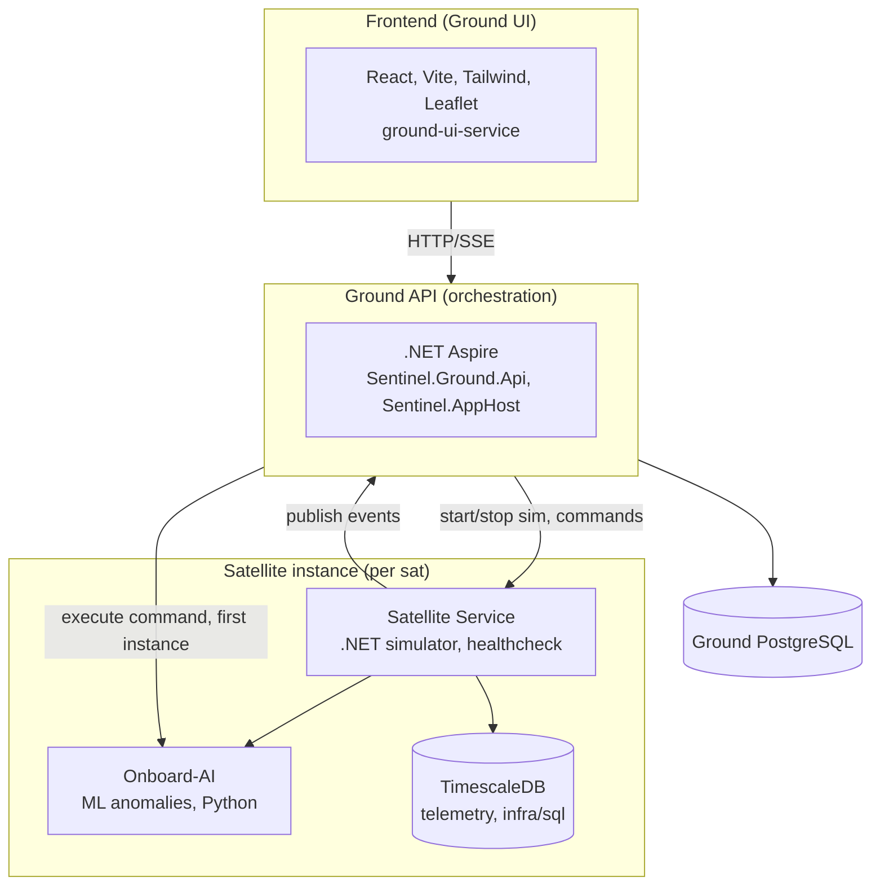
```mermaid
flowchart TB
  subgraph UI["Frontend (Ground UI)"]
    A[React, Vite, Tailwind, Leaflet<br/>ground-ui-service]
  end
  subgraph API["Ground API (orchestration)"]
    B[.NET Aspire<br/>Sentinel.Ground.Api, Sentinel.AppHost]
  end
  G[(Ground PostgreSQL)]
  subgraph Satellite["Satellite instance (per sat)"]
    C[Satellite Service<br/>.NET simulator, healthcheck]
    D[Onboard-AI<br/>ML anomalies, Python]
    E[(TimescaleDB<br/>telemetry, infra/sql)]
  end
  UI -->|HTTP/SSE| API
  API --> G
  API -->|start/stop sim, commands| C
  API -->|execute command, first instance| D
  C -->|publish events| API
  C --> E
  C --> D
```

### Repository layout

| Path | Description |
|------|-------------|
| **src/ground-ui-service** | Ground UI: React SPA (missions, satellites, telemetry, commands, mission map). Runs on port 5180 by default. |
| **src/satellite-autonomy-service** | .NET solution: Ground API (Aspire host), Core/Infrastructure, Satellite simulator service. |
| **src/onboard-ai-service** | Python service: ML anomaly detection (e.g. Isolation Forest), simulates onboard-style scoring. |
| **infra/** | SQL init, hypertables, retention; scripts (e.g. reset DB volumes). |
| **docs/ui** | UI documentation screenshots (generated by Playwright). |
| **volumes/** | Runtime volumes (e.g. DB data). |

### Main capabilities

- **Mission assurance** - Missions and satellites, attach/detach, command queue and templates.
- **Ground segment** - .NET API, time-series storage (PostgreSQL/TimescaleDB), real-time event stream (SSE) per mission and satellite.
- **Onboard-style ML** - Anomaly scoring on telemetry (e.g. Isolation Forest), explainable decisions, healthcheck events (mlResult + decision) pushed to ground.
- **Commands** - Data-driven command types, priority, TTL; execution and status.
- **UI** - Mission map (satellite positions from telemetry), satellite dashboard (telemetry bucket, ML panel, Healthcheck feed, commands, simulator).

### Tech stack

- **Ground:** .NET (Aspire), PostgreSQL (TimescaleDB).
- **Satellite/simulator:** .NET service (simulates spacecraft and link).
- **Onboard-AI (simulated):** Python (time-series anomaly detection).
- **Frontend:** React, Vite, Tailwind, Leaflet (mission map).

Onboard flight software is out of scope; a separate edge agent (C++/Rust/Python) would integrate with the Ground API.

## Running the project

**Prerequisites:** [.NET SDK](https://dotnet.microsoft.com/download) and [Docker](https://www.docker.com/products/docker-desktop/) (AppHost runs PostgreSQL, TimescaleDB, Ground UI, Onboard-AI and Satellite Service as containers).

```bash
dotnet run --project src/satellite-autonomy-service/Sentinel.AppHost
```

## Collaborators

| Project | Path | Contributors |
|--------|------|--------------|
| **Backend** | `src/satellite-autonomy-service` | [curiousvlxd](https://github.com/curiousvlxd) |
| **UI** | `src/ground-ui-service` | [curiousvlxd](https://github.com/curiousvlxd), [AndriiS1](https://github.com/AndriiS1) |
| **AI module** | `src/onboard-ai-service` | [kravchenkodiana07-art](https://github.com/kravchenkodiana07-art) |

## UI showcase

**Home**

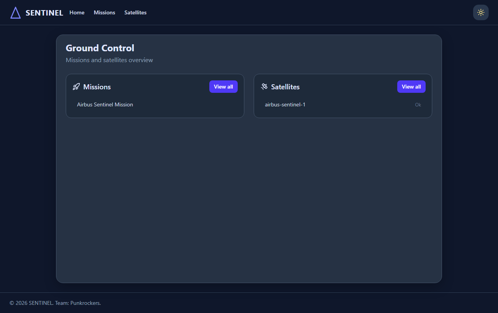

Landing page.

**Missions list**

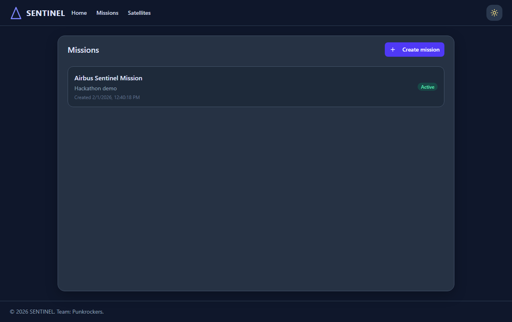

List of missions.

**Mission form**

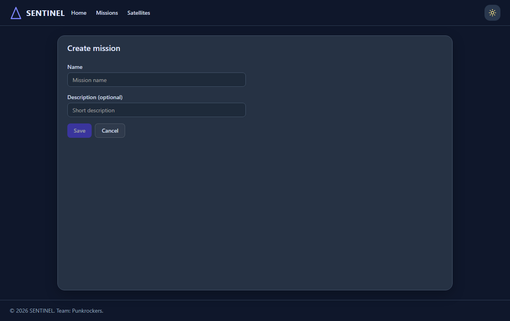

Create or edit mission.

**Mission details - Satellites tab**

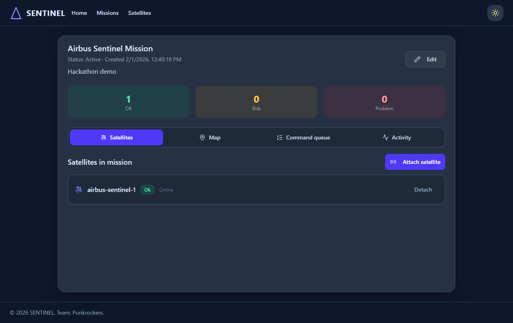

Satellites in mission, attach/detach.

**Mission details - Map tab**

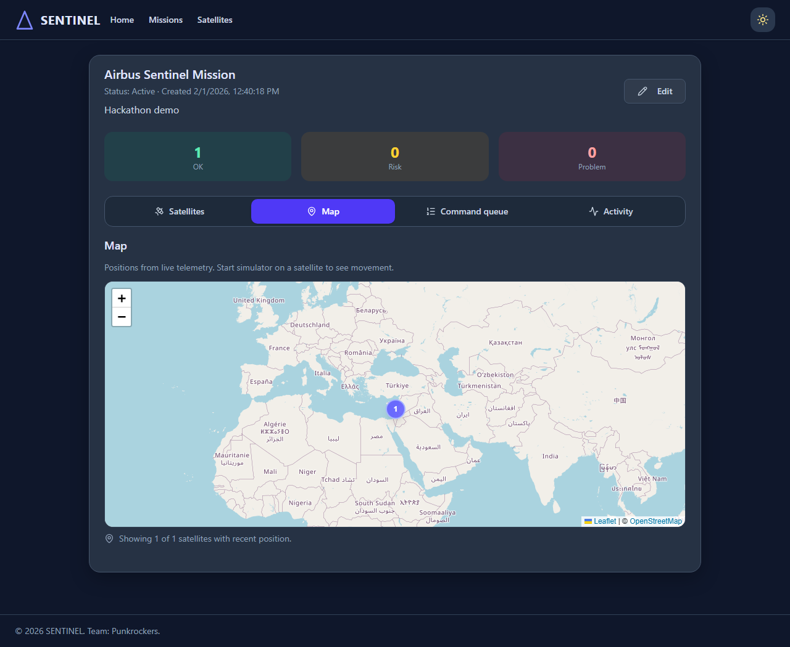

Mission map and details in one view (no scroll); satellite positions from telemetry.

**Mission details - Command queue tab**

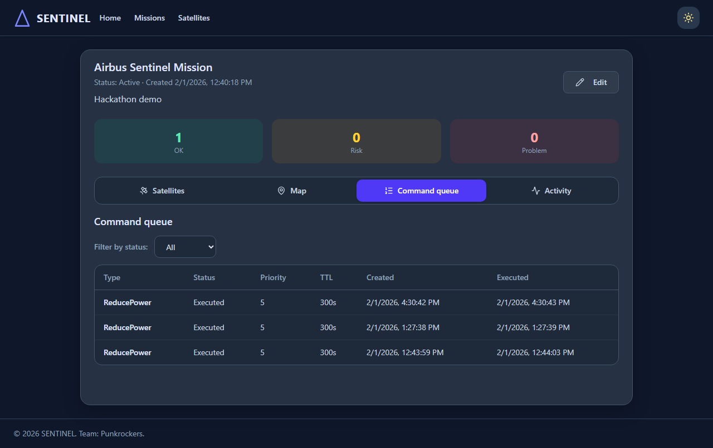

Command queue for the mission.

**Mission details - Activity tab**

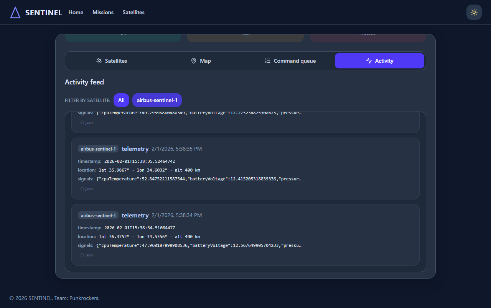

Activity feed for the mission.

**Satellites list**

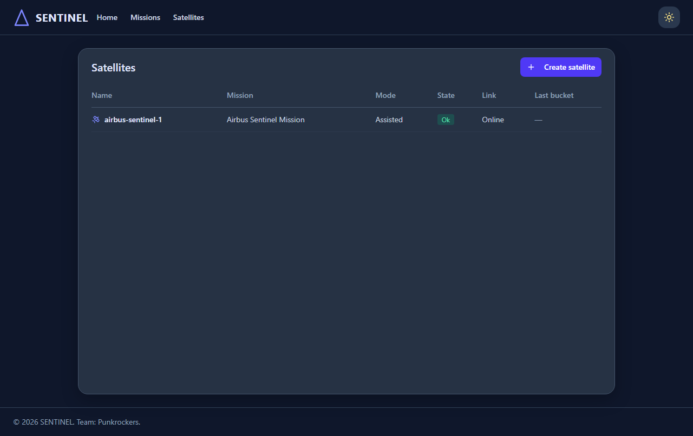

List of satellites.

**Satellite form**

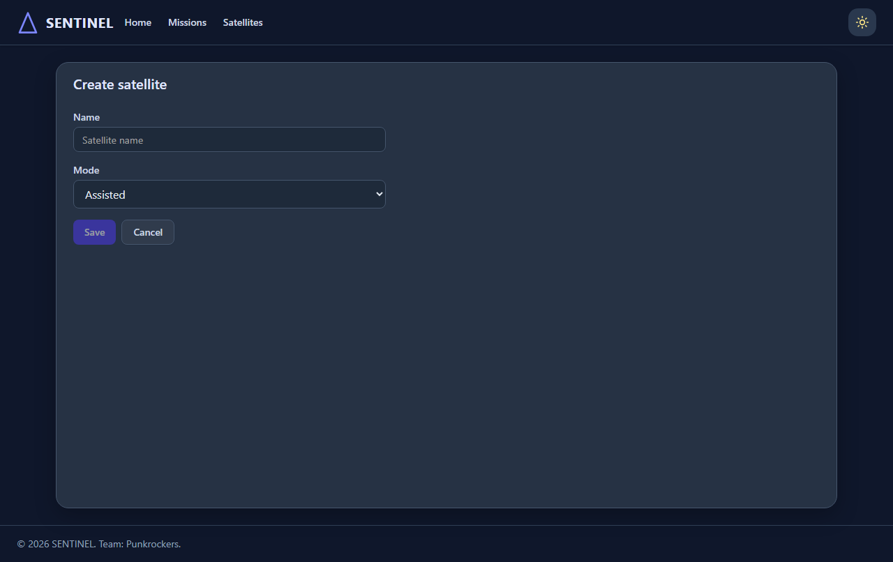

Create or edit satellite.

**Satellite page - Activity tab (top)**

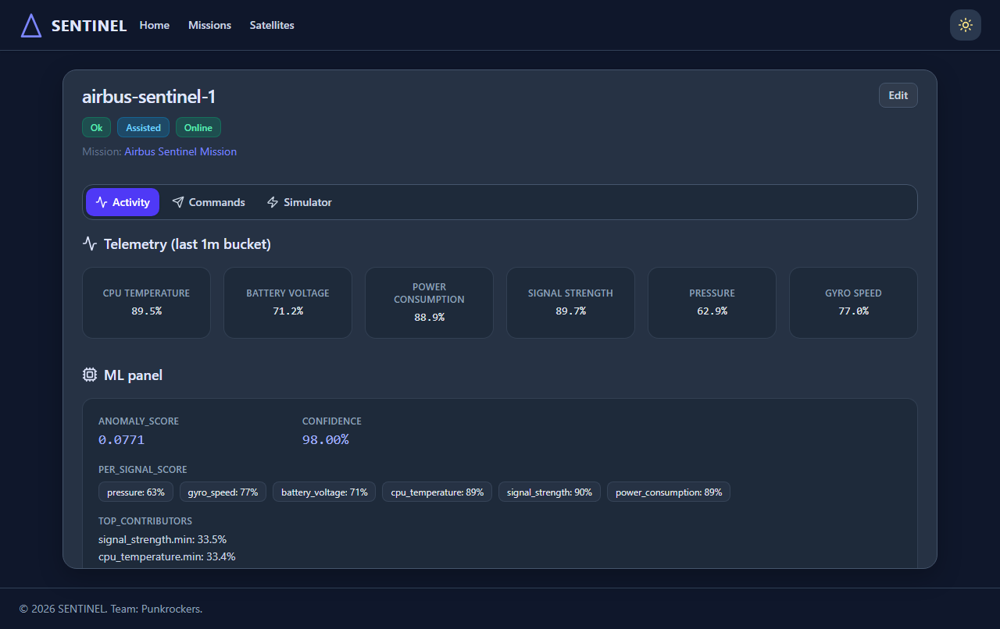

Activity tab, scroll at top - Telemetry, ML panel, Healthcheck feed, Telemetry feed.

**Satellite page - Activity tab (scrolled)**

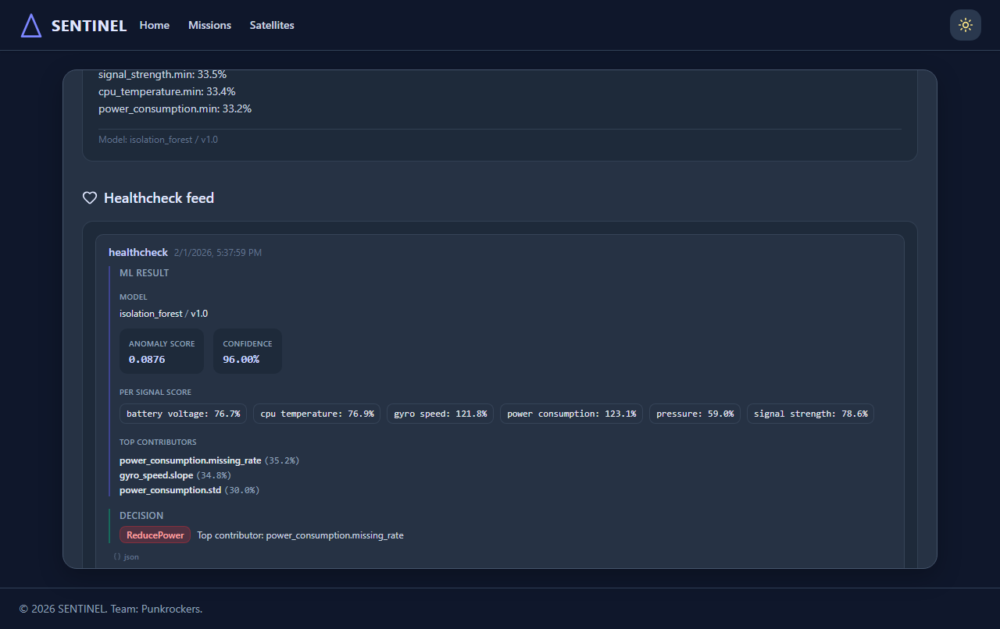

Activity tab, scrolled halfway - lower part of the activity content.

**Satellite page - Activity tab (bottom)**

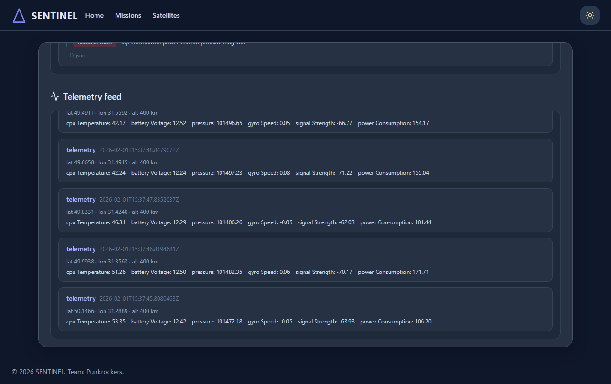

Activity tab, component scroll at bottom - end of Healthcheck/Telemetry feed.

**Satellite page - Commands tab (top)**

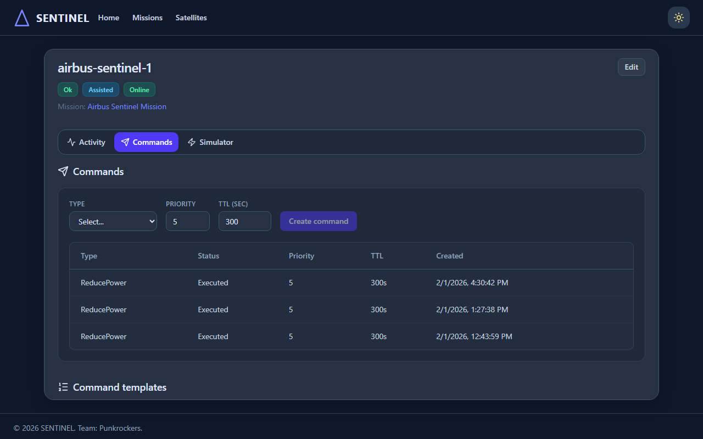

Commands tab, scroll at top - Commands and command templates.

**Satellite page - Commands tab (scrolled)**

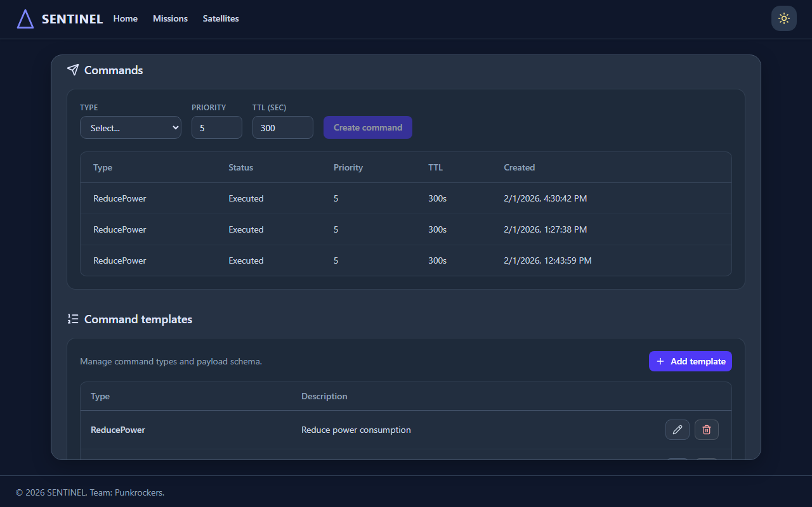

Commands tab, scrolled halfway - lower part of the commands content.

**Satellite page - Simulator tab**

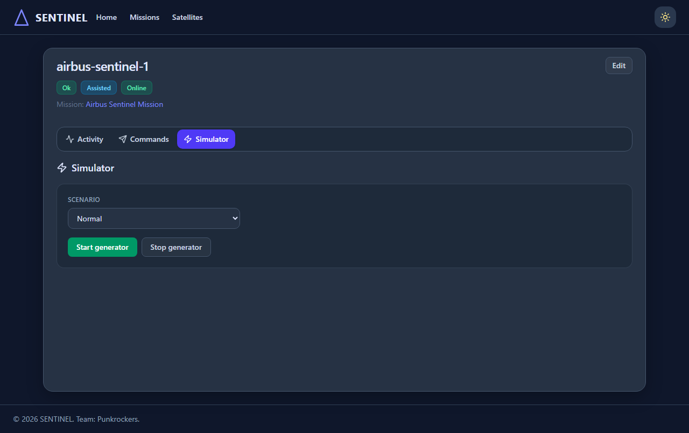

Simulator scenario (Normal/Mixed/Anomaly).
